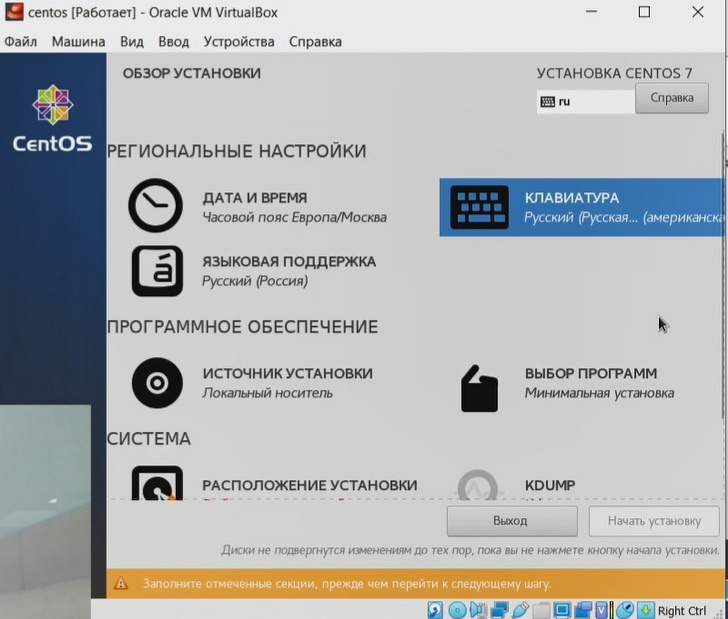

---
# Front matter
lang: ru-RU
title: "Лабораторная работа № 1"
subtitle: "Установка и конфигурация операционной системы на виртуальную машину."
author: "Алибаева Данагуль НБибд-01-18"

# Formatting
toc-title: "Содержание"
toc: true # Table of contents
toc_depth: 2
lof: true # List of figures
lot: true # List of tables
fontsize: 12pt
linestretch: 1.5
papersize: a4paper
documentclass: scrreprt
polyglossia-lang: russian
polyglossia-otherlangs: english
mainfont: PT Serif
romanfont: PT Serif
sansfont: PT Sans
monofont: PT Mono
mainfontoptions: Ligatures=TeX
romanfontoptions: Ligatures=TeX
sansfontoptions: Ligatures=TeX,Scale=MatchLowercase
monofontoptions: Scale=MatchLowercase
indent: true
pdf-engine: lualatex
header-includes:
  - \linepenalty=10 # the penalty added to the badness of each line within a paragraph (no associated penalty node) Increasing the value makes tex try to have fewer lines in the paragraph.
  - \interlinepenalty=0 # value of the penalty (node) added after each line of a paragraph.
  - \hyphenpenalty=50 # the penalty for line breaking at an automatically inserted hyphen
  - \exhyphenpenalty=50 # the penalty for line breaking at an explicit hyphen
  - \binoppenalty=700 # the penalty for breaking a line at a binary operator
  - \relpenalty=500 # the penalty for breaking a line at a relation
  - \clubpenalty=150 # extra penalty for breaking after first line of a paragraph
  - \widowpenalty=150 # extra penalty for breaking before last line of a paragraph
  - \displaywidowpenalty=50 # extra penalty for breaking before last line before a display math
  - \brokenpenalty=100 # extra penalty for page breaking after a hyphenated line
  - \predisplaypenalty=10000 # penalty for breaking before a display
  - \postdisplaypenalty=0 # penalty for breaking after a display
  - \floatingpenalty = 20000 # penalty for splitting an insertion (can only be split footnote in standard LaTeX)
  - \raggedbottom # or \flushbottom
  - \usepackage{float} # keep figures where there are in the text
  - \floatplacement{figure}{H} # keep figures where there are in the text
---

# Цель работы

Приобретение практических навыков установки операционной системы на виртуальную машину, настройки минимально необходимых для дальнейшей работы сервисов.

# Задание

1. Запустить терминал. Перейти в каталог /var/tmp

2. Создать каталог с именем пользователя

3. Перейти в общий каталог, где размещён образ виртуальной машины

4. Скопировать образ виртуальной машины в созданный на предыдущем шаге каталог

5. Запустить виртуальную машину и настроить её

6. Создать, запустить новую виртуальную машину и установить систему

# Теоретическое введение

CentOS (от англ. Community ENTerprise Operating System) — дистрибутив Linux, основанный на коммерческом Red Hat Enterprise Linux компании Red Hat и совместимый с ним. Согласно жизненному циклу Red Hat Enterprise Linux (RHEL), CentOS 5, 6 и 7 будут поддерживаться «до 10 лет», поскольку они основаны на RHEL. Ранее версия CentOS 4 поддерживалась семь лет.

Red Hat Enterprise Linux состоит из свободного ПО с открытым кодом, но доступен в виде дисков с бинарными пакетами только для платных подписчиков. Как требуется в лицензии GPL и других, Red Hat предоставляет все исходные коды. Разработчики CentOS используют данный исходный код для создания окончательного продукта, очень близкого к Red Hat Enterprise Linux и доступного для загрузки. Существуют и другие клоны Red Hat Enterprise Linux, созданные на основе этого кода.

CentOS использует программу Yum для загрузки и установки обновлений из репозитория CentOS Mirror Network, тогда как Red Hat Enterprise Linux получают обновления с серверов Red Hat Network. CentOS до версии 5.0 для обновлений использовал также программу up2date.

Помимо прочего, CentOS использовалась как ОС по умолчанию в проекте Cluster Compute Instance (CCI) от Amazon, суть которого заключается в том, что сдаются в аренду мощности большого числа стандартных стоечных серверов.

Компания Red Hat объявила о прекращении разработки дистрибутива CentOS 8 в своём классическом варианте, подразумевающем предоставление максимально приближенных пересборок выпусков Red Hat Enterprise Linux. 

Формирование обновлений для классического CentOS 8 будет прекращено 31 декабря 2021 года. Сопровождение ветки CentOS 7 будет продолжено без изменений до 2024 года.

Вместо классического CentOS пользователям будет предложено перейти на непрерывно обновляемую редакцию CentOS Stream. 

Также, компания CloudLinux, планирует выпустить альтернативу CentOS 8 под наименованием AlmaLinux, бинарно совместимую с RHEL. Дистрибутив будет базироваться на пакетной базе Red Hat Enterprise Linux 8. Первый выпуск дистрибутива обещают сформировать в течение первого квартала 2021 года. 

# Выполнение лабораторной работы

1.Лабораторная работа выполнялась дома со следующими характеристиками техники: 

– Intel(R) Core(TM) i5-8300H CPU @ 2.30GHz, 2304 МГц, ядер: 4, логических процессоров: 8
– ОС Майкрософт Windows 10 Pro
– VirtualBox верс. 6.1.26

2.Запустила вирутальную машину и указала папку для машин по умолчанию.

3.Создала новую виртуальную машину с именем centos, типом Linux, версией Red Hat. (рис. -@fig:001)

{ #fig:001 width=70% }

4.Указала объем оперативной памяти 1024 МБ  (рис. -@fig:002)

{ #fig:002 width=70% }

5.Указала, что требуется создать новый виртуальный жесткий диск. (рис. -@fig:003)

{ #fig:003 width=70% }

6.Указала тип файла VDI (VirtualBox Disk Image). (рис. -@fig:004)

{ #fig:004 width=70% }

7.Указала формат хранения как динамический виртуальный жесткий диск. (рис. -@fig:005)

{ #fig:005 width=70% }

8.Указала имя и размер файла 20 ГБ. (рис. -@fig:006)

{ #fig:006 width=70% }

9.Добавила новый привод оптических дисков и выбрала образ CentOS-7-i386-Everything-2009. (рис. -@fig:007) 

{ #fig:007 width=70% }

10.Запустила виртуальную машину.
 
11.Установила русский язык для интерфейса и раскладки клавиатуры. (рис. -@fig:008) 

{ #fig:008 width=70% }

12.Сделала настройки клавиатуры, даты и времени. (рис. -@fig:009)
 
13.В источнике установки установила локальный носитель.(рис. -@fig:009)

{ #fig:009 width=70% }

14.В выборе программ выбрала сервер с GUI и отметила установку средств разработки. (рис. -@fig:010) 

{ #fig:010 width=70% }

15.В расположении установки выбрала создать разделы автоматически. (рис. -@fig:011)

16.Отключила Kdump. (рис. -@fig:011)

17.Далее включила сеть и изменила имя узла на dalibaeva.localdomain. (рис. -@fig:011)

{ #fig:011 width=70% }

18.При конфигурации создала пароль. (рис. -@fig:012)  и пользователя, сделав его администратором. (рис. -@fig:013)

{ #fig:012 width=70% }

{ #fig:013 width=70% }

19.После установки пакетов, я приняла лицензию. (рис. -@fig:014)

{ #fig:014 width=70% }

20.После перезагрузки, я вошла в систему. (рис. -@fig:015)

{ #fig:015 width=70% }

21.Сделала установку драйверов для взаимодействия с системой. (рис. -@fig:016)

{ #fig:016 width=70% }

22.После перезагрузки, перешла под учетную запись root с помощью команды su. (рис. -@fig:017)

{ #fig:017 width=70% }

23.С помощью команды yum update обновила системные файлы (рис. -@fig:018) и установила необходимые программы, например, yum install mc (рис. -@fig:019) 

{ #fig:018 width=70% }

{ #fig:019 width=70% }

# Выводы

Приобрела практические навыки установки операционной системы CentOS 7 на виртуальную машину, настройки минимально необходимых для дальнейшей работы сервисов.

# Список литературы 

1.CentOS // Википедия URL: https://ru.wikipedia.org/wiki/CentOS (дата обращения: 16.09.2021).